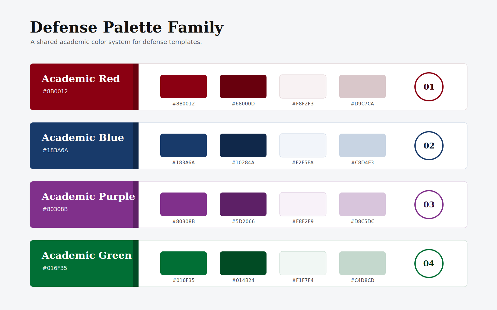

# EasySlides

[中文](#中文) | [English](#english)



---

## 中文

EasySlides 是一个面向学术汇报与研究型演示文稿的本地 PPTX 生成工具链。它的核心目标是把论文、报告、网页、Markdown 等来源材料转换为结构清晰、风格一致、并且可以在 PowerPoint 中继续编辑的演示文稿。

核心流程：

```text
来源材料 -> 项目工作区 -> Deck Plan -> SVG/布局模板 -> 可编辑 PPTX
```

### 项目结构

- `SKILL.md`：学术 PPT 工作流的主说明。
- `scripts/`：转换、项目管理、SVG 校验、模板导入、PPTX 导出等工具。
- `templates/`：学术布局模板、风格包、图表模块与图标库。
- `references/`：写作规范、设计规则、执行器/策略器参考。
- `workflows/`：预览、音频、模板创建、图表验证、主题调研等扩展流程。
- `tests/`：模板契约、CLI 入口与核心工具的回归测试。

### 快速开始

```powershell
python -m pip install -r requirements.txt
python -m pytest -q
```

创建一个本地演示项目：

```powershell
python scripts/project_manager.py init my_presentation --format ppt169
python scripts/project_manager.py import-sources projects/my_presentation <source_files...> --copy
python scripts/project_manager.py validate projects/my_presentation
```

在完成 SVG 页面编排后导出 PPTX：

```powershell
python scripts/finalize_svg.py projects/my_presentation
python scripts/svg_to_pptx.py projects/my_presentation
```

### 模板

当前可发布的学术布局模板位于 `templates/layouts/`，索引文件为 `templates/layouts/layouts_index.json`。旧模板 ID 的兼容映射记录在 `templates/layouts/aliases.json`，其中 `defense_s01` 已指向 `defense_leftnav`，`literature_s01` 已指向 `literature_minimal`。

常用维护命令：

```powershell
python scripts/svg_quality_checker.py templates/layouts/defense_leftnav --template-mode --format ppt169
python scripts/svg_quality_checker.py templates/layouts/defense_topnav --template-mode --format ppt169
python scripts/svg_quality_checker.py templates/layouts/literature_minimal --template-mode --format ppt169
python scripts/register_template.py --rebuild-all
```

### 致谢

EasySlides 在多个开源项目与公开实践的启发上继续扩展。为避免把不同层次的贡献混在一起，这里按项目所启发的能力层次致谢：

- **工程底座**：[hugohe3/ppt-master](https://github.com/hugohe3/ppt-master) 为可编辑 PPTX 生成提供了重要的工程框架、工作流组织方式与基础能力，EasySlides 在此基础上继续发展本地 SVG 到 DrawingML/PPTX 的生成链路。
- **学术表达**：[Gabberflast/academic-pptx-skill](https://github.com/Gabberflast/academic-pptx-skill) 为结构化论证、学术表达、引用规范和沟通优先的设计原则提供了重要参考。
- **叙事编排**：[LearnPrompt/humanize-ppt](https://github.com/LearnPrompt/humanize-ppt) 的 Audience-State-Transfer 思想提醒我们，PPT 不只是信息容器，更是观众状态转移的路径；这启发了 EasySlides 对通用学术模板、SCQA 叙事结构和页面级听众推进的规则设计。
- **风格与模板治理**：[op7418/guizang-ppt-skill](https://github.com/op7418/guizang-ppt-skill) 启发了本项目对风格约束包、可复用设计规范和模板治理方式的组织。
- **论文与文献报告流程**：[xiao634zhang/paper-ppt-skill](https://github.com/xiao634zhang/paper-ppt-skill) 与 [fangyuanopus/literature-report-ppt-builder](https://github.com/fangyuanopus/literature-report-ppt-builder) 为论文汇报、文献报告和 academic PPT skills 的构建提供了有价值的思路。

本项目在上述开源工作的启发与基础上继续扩展，新增代码、模板、规则与项目组织由 EasySlides 维护；除非原项目另有说明，以上致谢不代表相关项目对 EasySlides 的正式背书。

### 发布与隐私

`projects/` 下的生成物、论文原文、导出 PPT、预览图、解包 Office XML 和本地 QA 输出默认不会进入 Git。建议只提交可复用代码、模板、测试和文档。

API Key 请放在环境变量或本地 `.env` 中，不要提交真实密钥。`.env.example` 仅用于说明支持的配置项。

[Back to top](#easyslides)

---

## English

EasySlides is a local PPTX generation toolchain for academic talks and research presentations. Its goal is to turn papers, reports, web pages, Markdown, and other source materials into structured, visually consistent, and PowerPoint-editable decks.

Core pipeline:

```text
source material -> project workspace -> deck plan -> SVG/layout templates -> editable PPTX
```

### Repository Layout

- `SKILL.md`: main operating guide for the academic PPT workflow.
- `scripts/`: utilities for conversion, project management, SVG validation, template import, and PPTX export.
- `templates/`: academic layout templates, style packs, chart modules, and icon libraries.
- `references/`: authoring standards, design rules, strategist/executor guidance.
- `workflows/`: optional flows for preview, audio, template creation, chart verification, and topic research.
- `tests/`: regression tests for template contracts, CLI entry points, and core tools.

### Quick Start

```powershell
python -m pip install -r requirements.txt
python -m pytest -q
```

Create a local deck project:

```powershell
python scripts/project_manager.py init my_presentation --format ppt169
python scripts/project_manager.py import-sources projects/my_presentation <source_files...> --copy
python scripts/project_manager.py validate projects/my_presentation
```

Export a PPTX after authoring SVG pages:

```powershell
python scripts/finalize_svg.py projects/my_presentation
python scripts/svg_to_pptx.py projects/my_presentation
```

### Templates

Active academic layout templates live under `templates/layouts/` and are indexed in `templates/layouts/layouts_index.json`. Legacy template IDs are recorded in `templates/layouts/aliases.json`; `defense_s01` now resolves to `defense_leftnav`, and `literature_s01` now resolves to `literature_minimal`.

Useful maintenance commands:

```powershell
python scripts/svg_quality_checker.py templates/layouts/defense_leftnav --template-mode --format ppt169
python scripts/svg_quality_checker.py templates/layouts/defense_topnav --template-mode --format ppt169
python scripts/svg_quality_checker.py templates/layouts/literature_minimal --template-mode --format ppt169
python scripts/register_template.py --rebuild-all
```

### Acknowledgements

EasySlides builds on several open-source projects and public practices. To keep the credits readable, we group them by the layer of capability they inspired:

- **Engineering foundation**: [hugohe3/ppt-master](https://github.com/hugohe3/ppt-master) provided important engineering architecture, workflow organization, and foundational capabilities for editable PPTX generation. EasySlides extends that foundation with its local SVG-to-DrawingML/PPTX pipeline.
- **Academic communication**: [Gabberflast/academic-pptx-skill](https://github.com/Gabberflast/academic-pptx-skill) provided important references for structured argument, academic communication, citation standards, and communication-first design.
- **Narrative orchestration**: [LearnPrompt/humanize-ppt](https://github.com/LearnPrompt/humanize-ppt) contributed an important Audience-State-Transfer perspective: a deck is not merely an information container, but a path for audience-state transfer. This influenced EasySlides' general academic templates, SCQA narrative structure, and page-level audience progression rules.
- **Style and template governance**: [op7418/guizang-ppt-skill](https://github.com/op7418/guizang-ppt-skill) inspired the way this project organizes style constraint packs, reusable design specifications, and template governance.
- **Paper and literature report workflows**: [xiao634zhang/paper-ppt-skill](https://github.com/xiao634zhang/paper-ppt-skill) and [fangyuanopus/literature-report-ppt-builder](https://github.com/fangyuanopus/literature-report-ppt-builder) offered valuable ideas for paper presentations, literature reports, and academic PPT skills.

EasySlides extends these open-source inspirations with its own code, templates, rules, and project structure. Unless otherwise stated by the upstream projects, these acknowledgements do not imply formal endorsement of EasySlides by the referenced projects.

### Publishing And Privacy

Generated decks, source papers, exported PPTX files, rendered previews, unpacked Office XML, and local QA outputs under `projects/` are ignored by default. Commit reusable code, templates, tests, and documentation; keep private source material and generated artifacts local unless they are explicitly cleared for publication.

API keys should live in environment variables or a local `.env`; never commit real credentials. Use `.env.example` only as a template for supported configuration values.

[Back to top](#easyslides)
